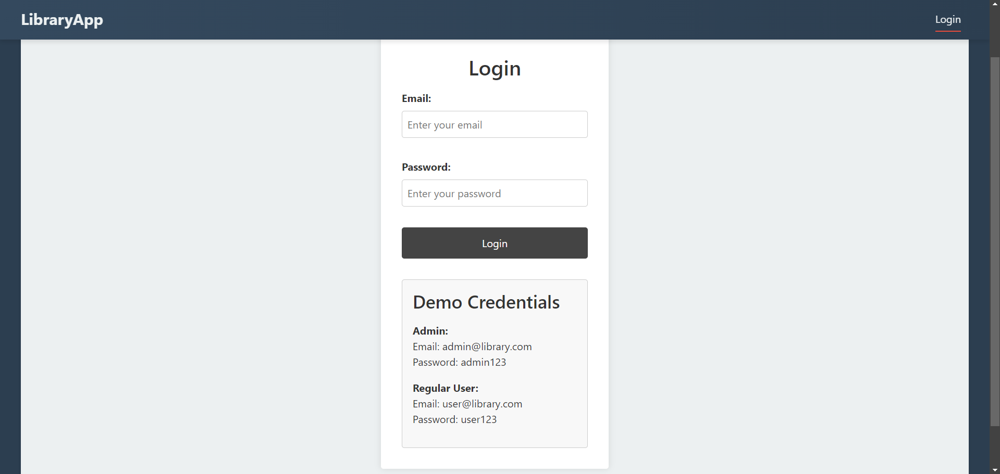
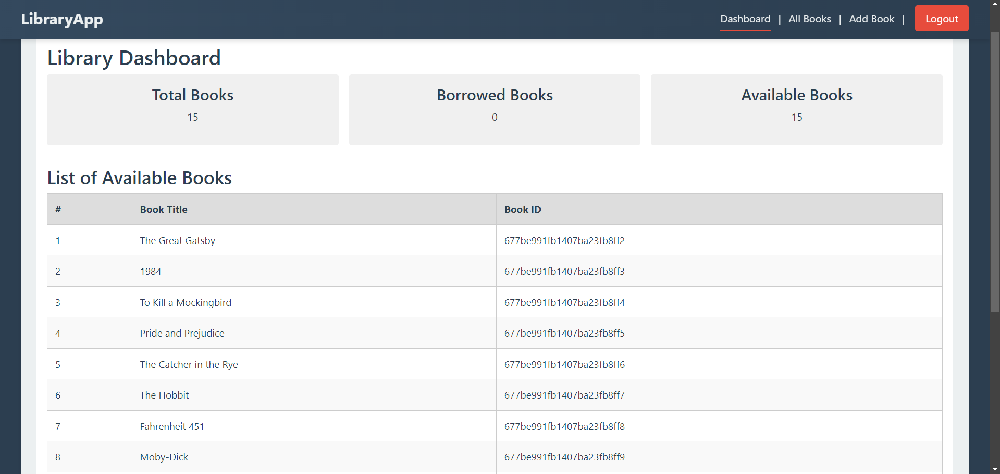
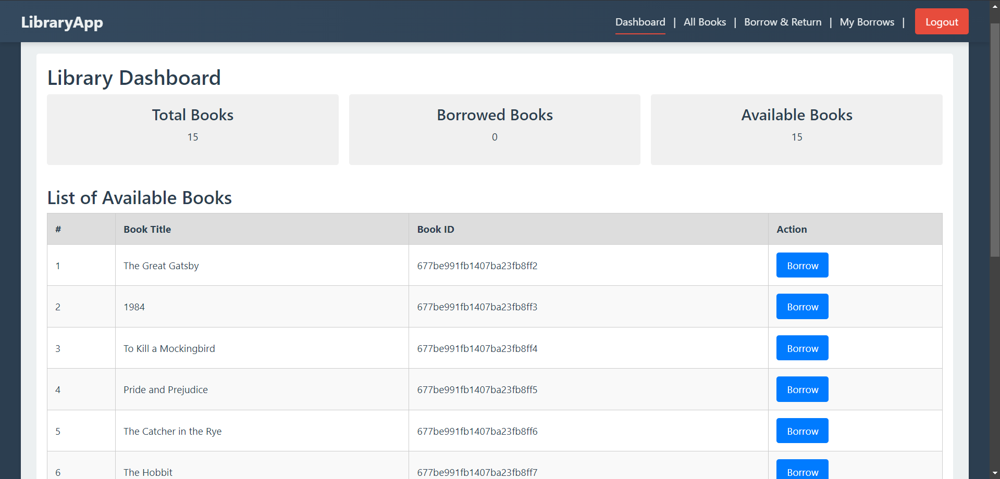
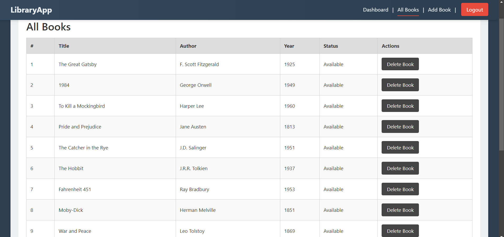
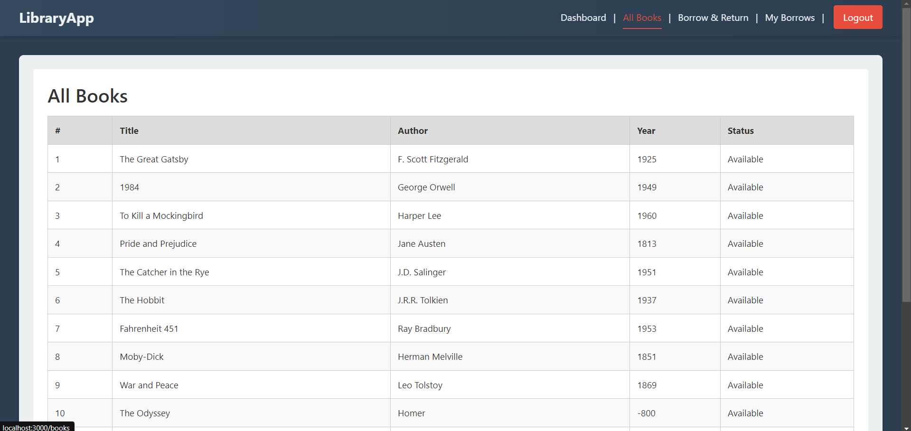
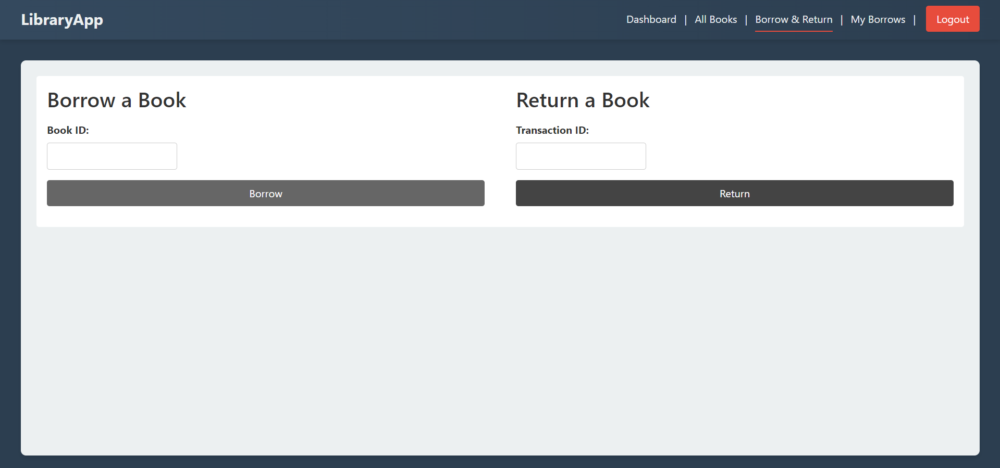
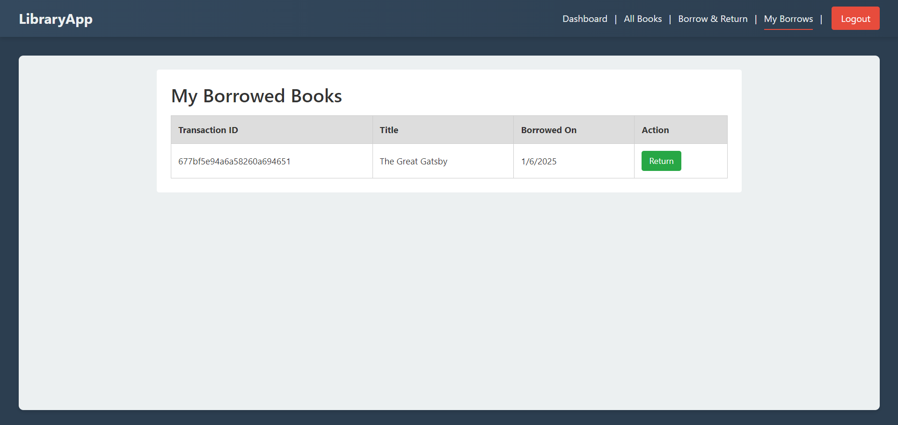
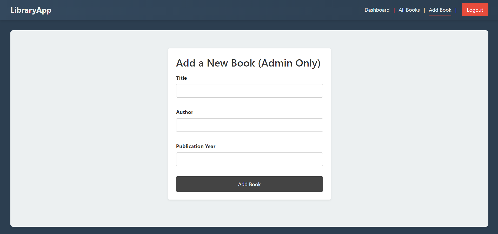

# Library Management System

A full-stack web application for managing library operations, built with the MERN stack (MongoDB, Express.js, React, Node.js).

## Features

### User Management
- **Role-based Authentication**: Admin and Regular User roles
- **JWT-based Authentication**: Secure token-based user sessions
- **Protected Routes**: Role-specific access control



### Book Management
- **Book Catalog**: View all available books
- **Admin Controls**: Add, update, and delete books (Admin only)
- **Availability Status**: Real-time tracking of book availability







### Borrowing System
- **Borrow Books**: Users can borrow available books
- **Return Books**: Users can return borrowed books
- **Transaction History**: Track all borrowing activities
- **My Borrows**: Users can view their current and past borrowings




### Dashboard
- **Statistics**: View total books, borrowed books, and available books
- **Available Books List**: Quick access to borrowable books
- **Real-time Updates**: Dynamic updates of book status




## Tech Stack

### Backend
- Node.js
- Express.js
- MongoDB with Mongoose
- JWT for authentication
- bcrypt for password hashing

### Frontend
- React
- React Router for navigation
- Axios for API requests
- Context API for state management
- CSS for styling

## Installation

### Prerequisites
- Node.js (v14 or higher)
- MongoDB
- npm or yarn

### Backend Setup

1. Navigate to backend directory:
```bash
cd backend
```

2. Install dependencies:
```bash
npm install
```

3. Create .env file with following variables:
```
PORT=5000

MONGO_URI="your_mongodb_connection_string"

JWT_SECRET="your_secret_key"
```

4. Seed the database:
```bash
node seeder.js
```

5. Start the server:
```bash
npm start
```


### Frontend Setup

1. Navigate to frontend directory:
```bash
cd frontend
```

2. Install dependencies:
```bash
npm install
```


3. Start the development server:
```bash
npm start
```


## Default Users

### Admin Account
- Email: admin@library.com
- Password: admin123

### Regular User Account
- Email: user@library.com
- Password: user123

## API Endpoints

### Books
- GET `/api/books` - Get all books
- POST `/api/books` - Add new book (Admin only)
- PUT `/api/books/:id` - Update book (Admin only)
- DELETE `/api/books/:id` - Delete book (Admin only)

### Users
- POST `/api/users/login` - User login

### Transactions
- POST `/api/transactions/borrow` - Borrow a book
- POST `/api/transactions/return` - Return a book
- GET `/api/transactions/mine` - Get user's transactions
- GET `/api/transactions` - Get all transactions (Admin only)

## Project Structure

```
project-root/
├── backend/
│   ├── config/
│   │   └── db.js
│   ├── controllers/
│   │   ├── bookController.js
│   │   ├── transactionController.js
│   │   └── userController.js
│   ├── middleware/
│   │   └── authMiddleware.js
│   ├── models/
│   │   ├── Book.js
│   │   ├── Transaction.js
│   │   └── User.js
│   ├── routes/
│   │   ├── bookRoutes.js
│   │   ├── transactionRoutes.js
│   │   └── userRoutes.js
│   ├── .env
│   ├── package.json
│   ├── seeder.js
│   └── server.js
│
└── frontend/
    ├── public/
    │   ├── index.html
    │   └── manifest.json
    ├── src/
    │   ├── context/
    │   │   └── UserContext.js
    │   ├── pages/
    │   │   ├── css/
    │   │   │   ├── AddBook.css
    │   │   │   ├── BookList.css
    │   │   │   ├── BorrowReturn.css
    │   │   │   ├── Dashboard.css
    │   │   │   ├── Login.css
    │   │   │   └── MyBorrows.css
    │   │   ├── AddBook.js
    │   │   ├── BookList.js
    │   │   ├── BorrowReturn.js
    │   │   ├── Dashboard.js
    │   │   ├── Login.js
    │   │   └── MyBorrows.js
    │   ├── services/
    │   │   └── api.js
    │   ├── App.css
    │   ├── App.js
    │   └── index.js
    ├── .gitignore
    └── package.json
```

### Backend Structure
- `config/`: Database configuration
- `controllers/`: Request handlers for different routes
- `middleware/`: Authentication and authorization middleware
- `models/`: MongoDB schema definitions
- `routes/`: API route definitions
- `seeder.js`: Database seeding script
- `server.js`: Main application entry point

### Frontend Structure
- `public/`: Static files
- `src/`:
  - `context/`: React Context for state management
  - `pages/`: React components for different routes
  - `services/`: API service configuration
  - `App.js`: Main React component
  - `index.js`: React entry point


## Security Features

- Password Hashing
- JWT Authentication
- Protected Routes
- Role-based Access Control
- CORS Configuration

## Contributing

1. Fork the repository
2. Create your feature branch (`git checkout -b feature/AmazingFeature`)
3. Commit your changes (`git commit -m 'Add some AmazingFeature'`)
4. Push to the branch (`git push origin feature/AmazingFeature`)
5. Open a Pull Request

## License

This project is licensed under the ISC License.

## Acknowledgments

- MongoDB Atlas for database hosting
- React documentation
- Express.js documentation
- Node.js community